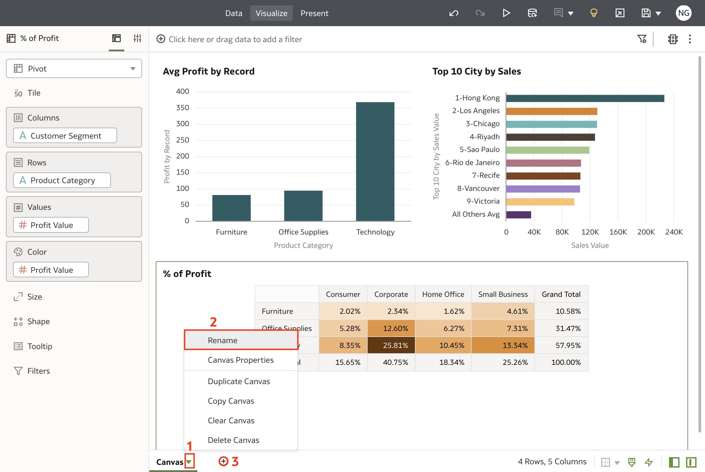
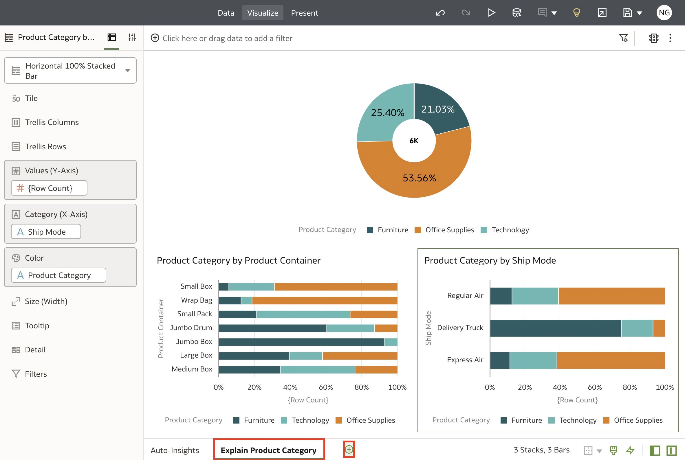
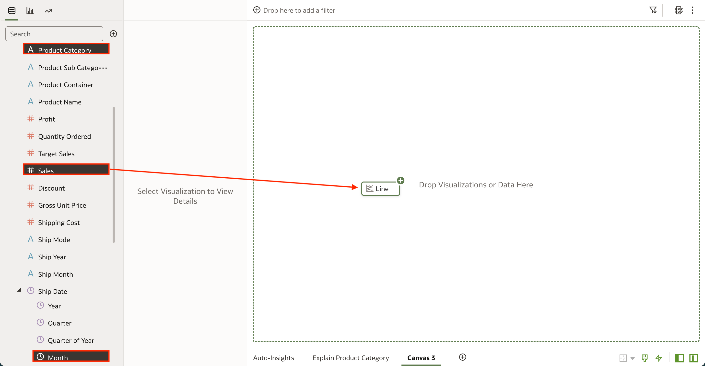
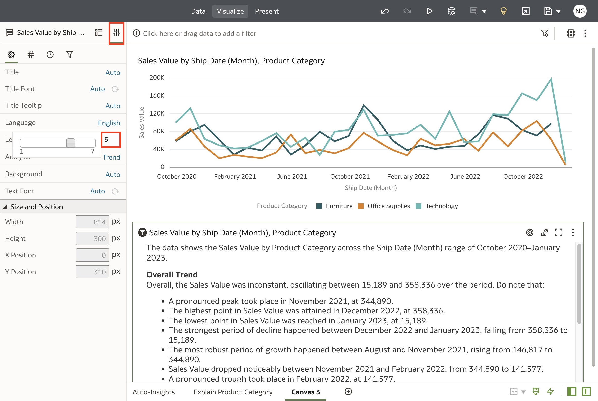
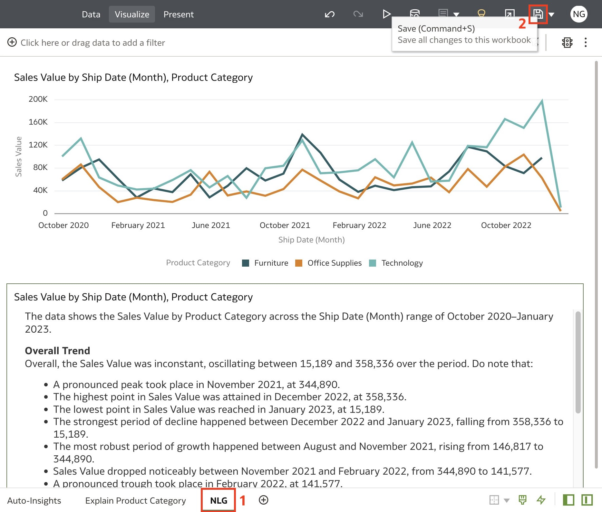

# Augmented Analytics

## Introduction

In this lab, you will learn about Oracle Analytics' Augmented Analytics capabilities to assist you in getting more insights into your data.

Estimated Time: 10 minutes

### Objectives

In this lab, you will:
* Create a canvas with Auto-Insights
* Understand more about a column using the Explain functionality
* Create a Language Narrative of your visualization

### Prerequisites

This lab assumes you have:
* Access to Oracle Analytics Cloud
* Sample Order Lines DS dataset

## Task 1: Create Custom Auto-Insights

1. From the Oracle Analytics homepage, click **Create** and then select **Workbook.**

  

2. In the **Add Data** dialogue, select **Sample Order Lines DS** and click **Add to Workbook.**

  

3. The auto-insights panel will auto-open with visualization suggestions to explore your data. To customize the data columns you want to see visualizations for, click the **Insights Settings** icon.

  

4. Let's generate auto-insights for Sales and Profit. From **Measures,** select **Sales** and uncheck **Discount.**

  

5. From **Small Size Attributes,** uncheck **Order Priority** and click **Apply.**

  

6. Expand the Auto Insights panel and choose any visual that you find interesting. For this lab, we will add **Avg Profit by Record**, **Top 10 City by Sales**, and **% of Profit**.

  

7. Close the Auto-Insights panel by clicking the **Auto-Insights** icon.

  

8. We have just created a canvas with visualizations auto-generated by Oracle Analytics.

  

9. Rename the canvas as **Auto-Insights** and click **Add Canvas**.

  

## Task 2: Explain Product Category

1. Right-click on **Product Category** and select **Explain Product Category**.

  

2. Explain gives you key visualizations with descriptions about the attribute or measure you choose to explain. From **Basic Facts**, click the **Add** icon of the donut chart to select the visualization to add to your canvas.

  

3. From **Key Drivers**, select the second and third visual to add to your canvas. Then click **Add Selected**.

  

4. This is another way to leverage Oracle Analytics' Augmented Analytics capability to kickstart your analysis. Rename the canvas to **Explain Product Category** and add another canvas. We will now explore the natural language generation capability in Oracle Analytics.

  

## Task 3: Natural Language Generation

1. In the new canvas, CTRL (Command on Mac) + click **Product Category**, **Sales**, and **Month** from **Ship Date**. Drag these three columns on the canvas to automatically create a line chart.

  

2. Let's duplicate the line chart by right-clicking the visualization and selecting **Edit**. Then select **Duplicate Visualization**.

  

3. On the bottom visualization, click the **Change Visualization Type** icon.

  

4. Select the **Language Narrative** visualization option.

  

5. You have now created a language narrative that describes the line chart. This is a great way to assist you in understanding the trends and insights from your visualizations.

  

6. If you want to change the level of granularity for the Language Narrative, click the **Properties** panel, and for **Level of Detail** choose your desired level of detail.

  

7. Rename the canvas to **NLG** and click the **Save** button to save the workbook.

  

In this lab, you have successfully learned how to use Oracle Analytics' Augmented Analytics capabilities.

## Learn More
* [Let Oracle Analytics Suggest the Best Visualizations for a Dataset Using Auto Insights](https://docs.oracle.com/en/cloud/paas/analytics-cloud/acubi/let-oracle-analytics-suggest-best-visualizations-dataset.html)

* [Add a Language Narrative Visualization](https://docs.oracle.com/en/cloud/paas/analytics-cloud/acubi/add-language-narrative-visualization.html#GUID-F25DA183-DFFB-4788-8581-B6D935A26EE9)

* [Analyze Data with Explain](https://docs.oracle.com/en/cloud/paas/analytics-cloud/acubi/analyze-data-explain.html#GUID-D1C86E85-5380-4566-B1CB-DC14E0D3919E)

* [4 Reasons Why Augmented Analytics is the Future of Business Intelligence](https://blogs.oracle.com/cloud-infrastructure/post/4-reasons-why-augmented-analytics-is-the-future-of-business-intelligence)

## Acknowledgements
* Author - Nagwang Gyamtso, Product Manager, Analytics Product Strategy
* Contributors -
* Last Updated By/Date - Nagwang Gyamtso, February, 2023
