# Create the Presentation Layer

## Introduction

In this lab, we will create another data flow to help us dig deeper into the matched products dataset. This time, we will use the **XX\_Matched\_Products** output dataset from the first data flow, join additional datasets to give us more context, apply data transformations and load the data to a new dataset.

Estimated Lab Time: 10 minutes

### Objectives

In this lab, you will:
* Create another data flow and add additional dataset
* Apply data transformations

### Prerequisites

This lab assumes you have:
* Access to Oracle Analytics Cloud
* Access to DV Content Author, BI Data Model Author, or a BI Service Administrator role
* All previous labs successfully completed

## Task 1: Create a Sales Discounting Data Flow

1. Click **Create** and select **Data Flow**.

	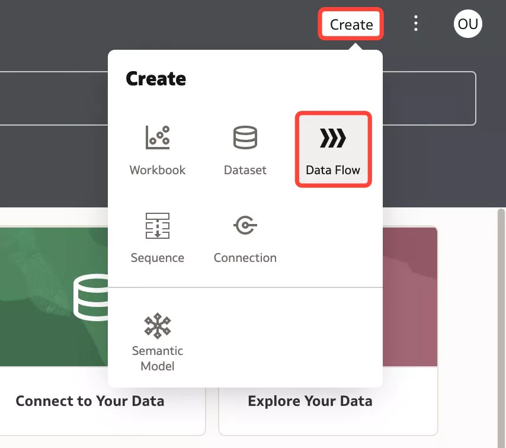

2. Search for and select the **XX\_Matched\_Products** dataset. Click **Add**.

	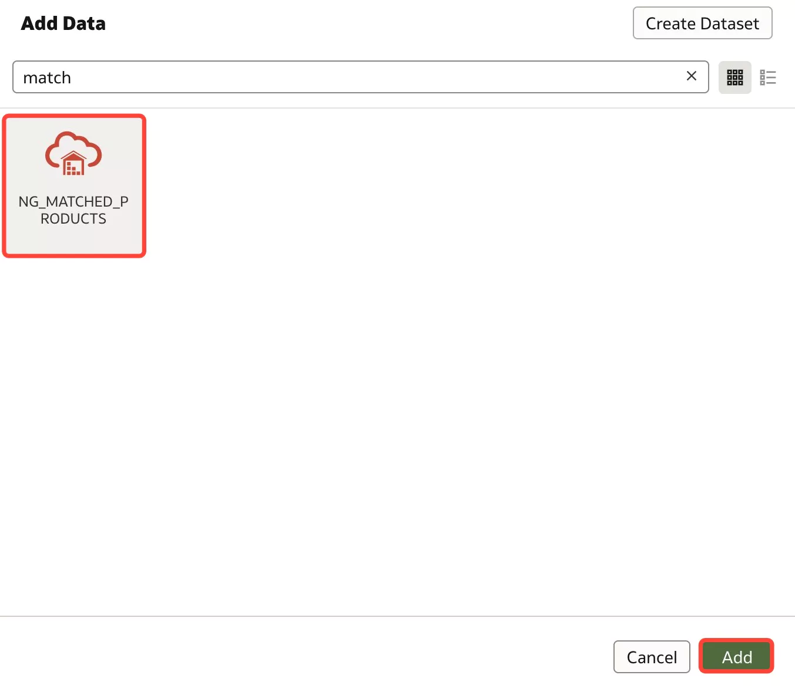

3. Click **Add a step** and select **Add Data**.

	

4. Search for and select the **Sales Orgs** dataset. Click **Add**.

	

5. An auto join is created using the **Sales Rep Name** column.

	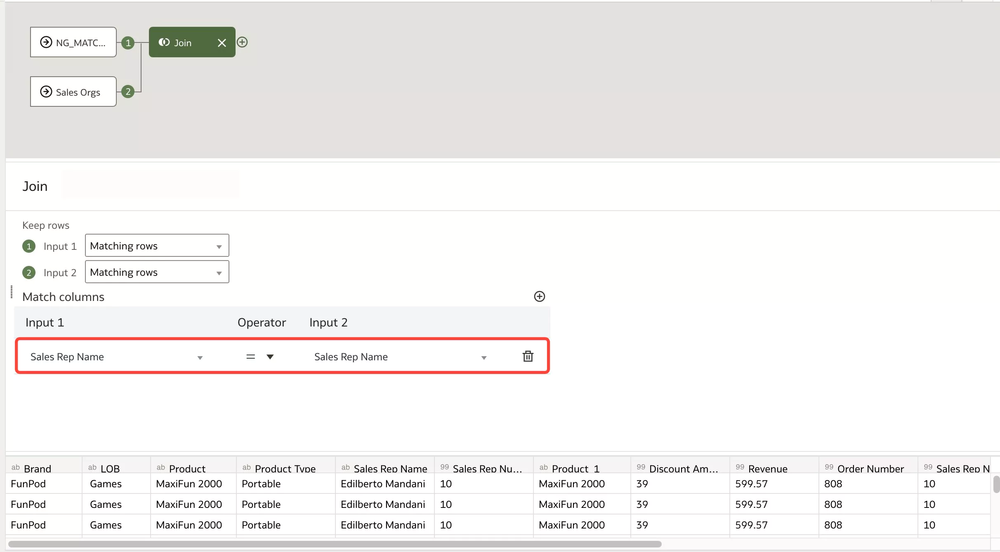

6. Click **Add a step** and select **Add Data**.

	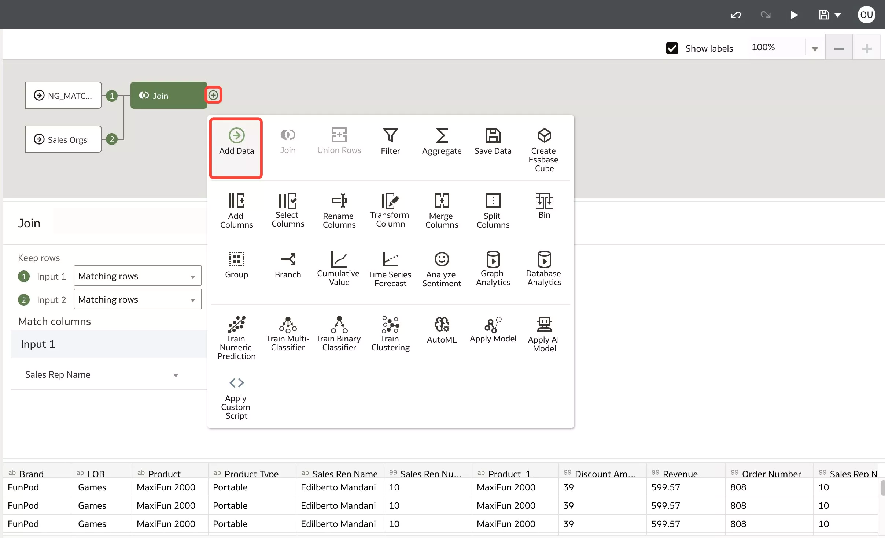

7. Search for the **Offices** dataset and click **Add**.

	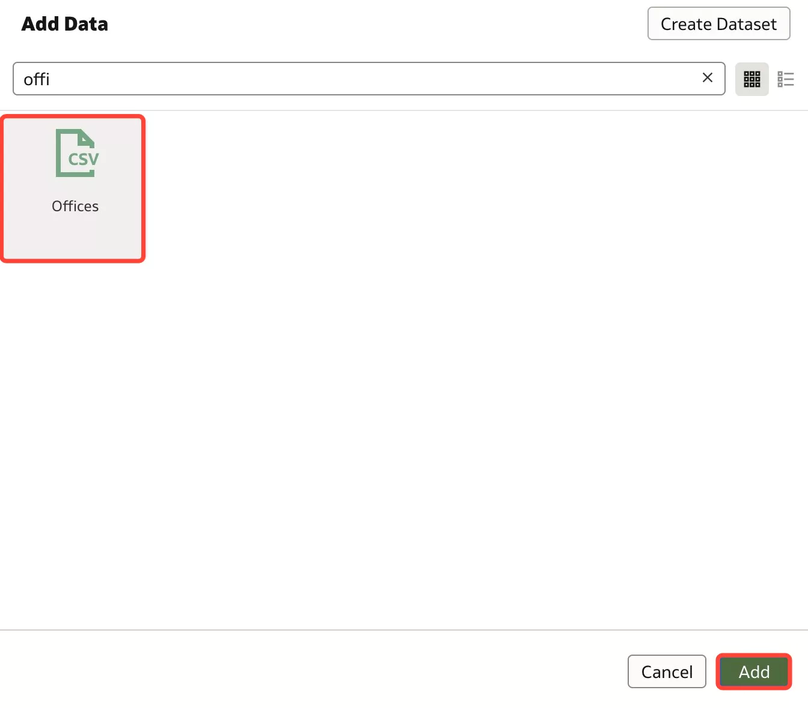

8. An auto-join will be created between the output dataset of the first join and the **Offices** dataset on the **Office** column.

	

## Task 2: Add and Remove Columns

1. Click **Add a step** and select **Add Columns**.

	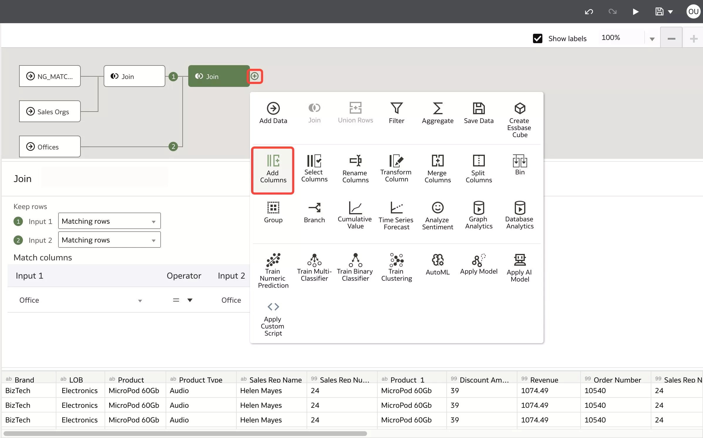

2. This will allow us to add a new column using the existing columns. We will create a **Discount % for Order** column that shows the discount % in each order.

	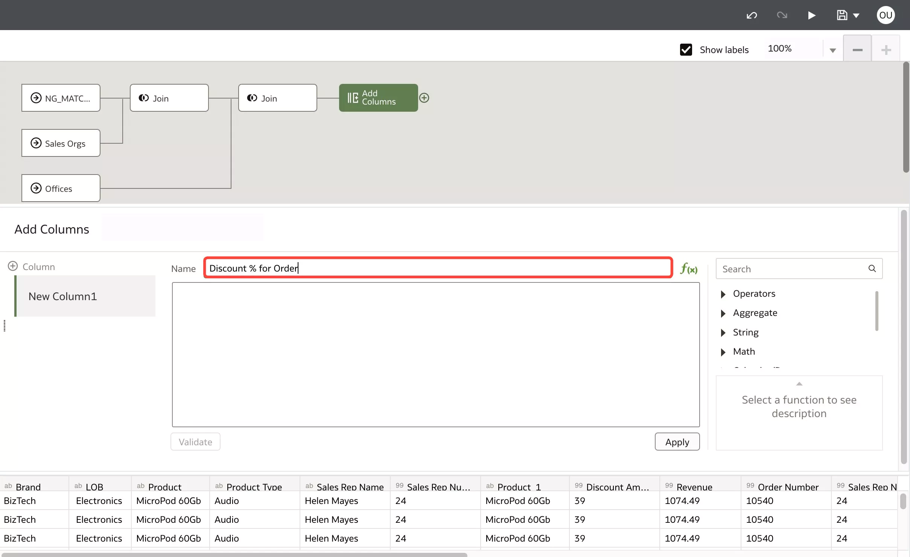

3. This will allow us to add a new column using the existing columns. We will create a **Discount % for Order** column that shows the discount % in each order. This column will be calculated on the fly as the data flow is run.

	In the expression editor, type **Dis**.  **A Discount Amount** will automatically pop up. Click **Discount Amount** to use this column.

	

12. Continue typing the rest of the expression: **Discount Amount / Revenue * 100** which will give us the discount %. Click **Validate** to ensure your expression is validated. Then click **Apply**.

	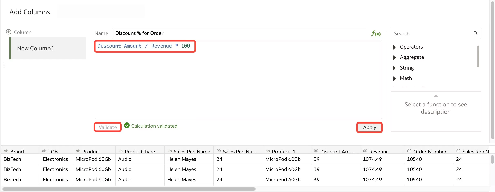

13. You will see the **Discount % for Order** column in the data preview pane on the bottom.

	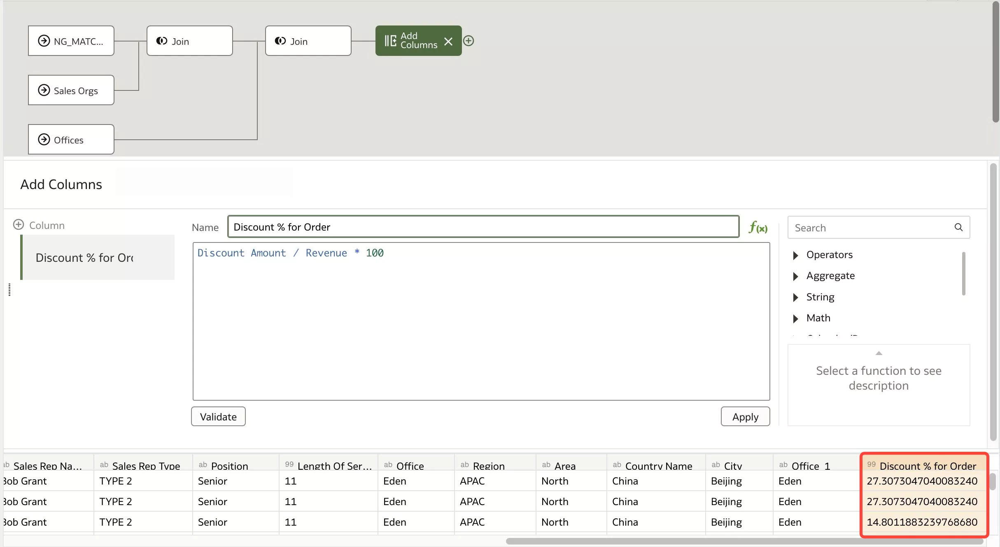

14. Click **Add a step**. This time, we will remove a few duplicate column or columns which we don't need in the dataset. Click **Select Columns**.

	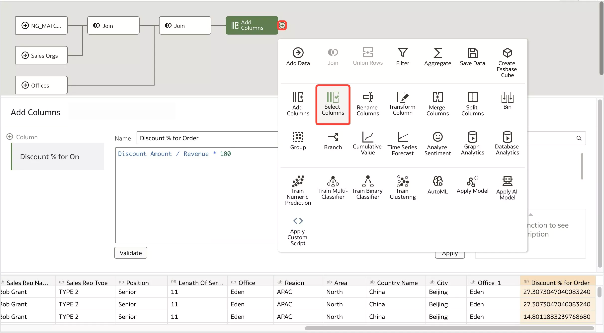

15. Hold the ctrl button on your keyboard and select **Sales Rep Number**, **Product\_1**, **Sales Rep Number\_1**, **Sales Rep Name\_1**, and **Office\_1**. Click **Remove selected**. We will not be needing these columns.

	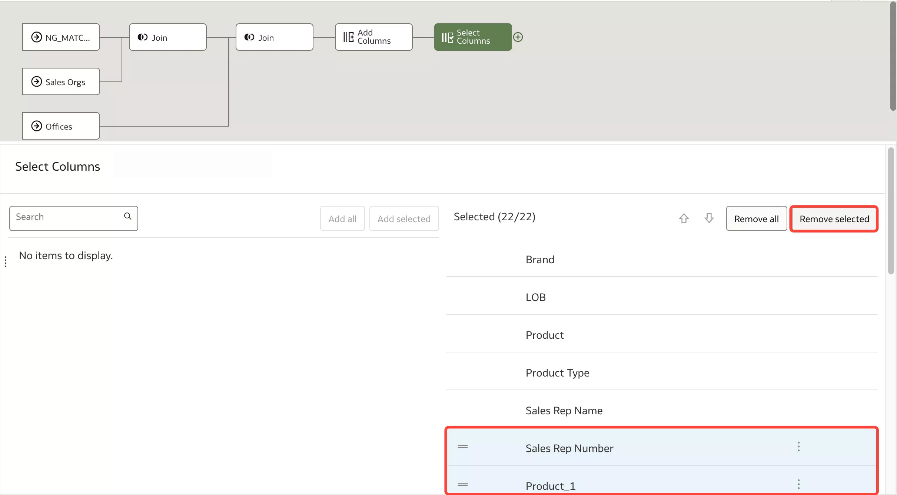

## Task 3: Save and Run the Data Flow

1. Click **Add a step** and select **Save Data**.

	

2. Enter **XX\_Sales\_Discounting** as the dataset name and select **Database Connection** for **Save data to**.

	

3. Select the **ADW4Workshops** connection. Then click **Save** to save the data flow.

	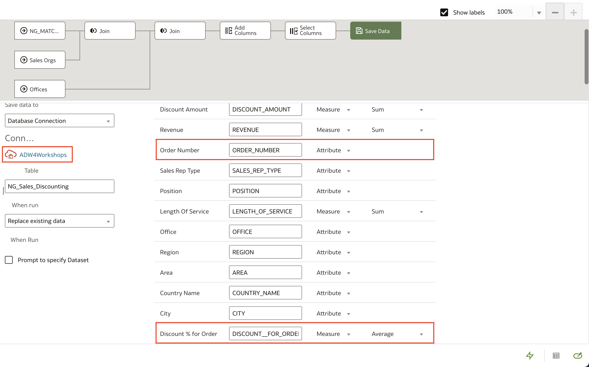

4. Enter **XX\_Sales\_Discounting** for the **Name** and click Click **OK**.

	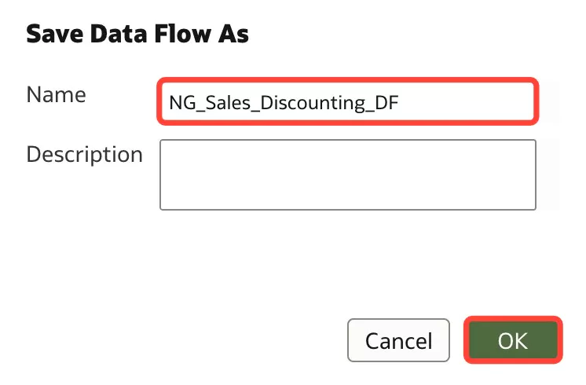

5. Click **Run** to run the data flow. This data flow will output the **XX_Sales_Discounting** dataset which was created by joining the **Matched_Products**, **Sales Orgs** and **Offices** datasets and also includes the **Discount % for Order** column which we created using the expression editor.

	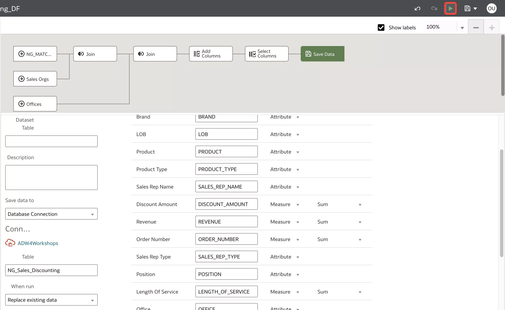

6. Click the back arrow to return to the homepage.

	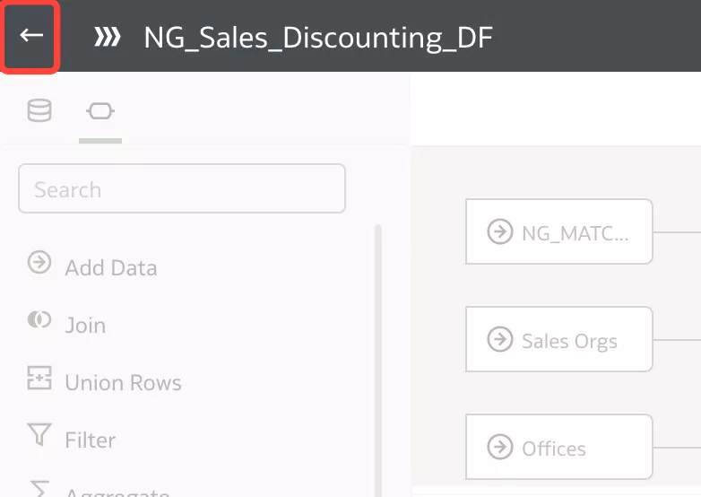

You may now **proceed to the next lab**.

## Learn More
* [Explore Data Flows in Oracle Analytics](https://docs.oracle.com/en/cloud/paas/analytics-cloud/tutorial-explore-data-flows/#before_you_begin)
* [Create Datasets Using Data Flows](https://docs.oracle.com/en/cloud/paas/analytics-cloud/acubi/create-datasets-using-data-flows.html#GUID-559E3C73-68A1-4982-AA1B-E0C487E9EA50)

## Acknowledgements
* Author - Nagwang Gyamtso, Product Manager, Analytics Product Strategy
* Contributors - Pravin Janardanam, Shounak Ganguly, Gabrielle Prichard
* Last Updated By/Date - Nagwang Gyamtso, February, 2023
