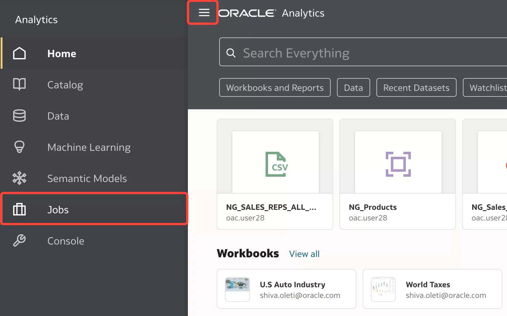
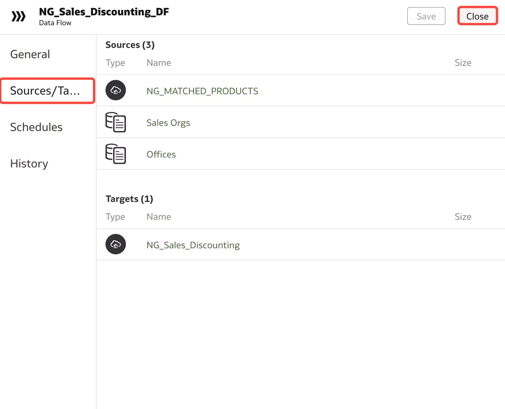
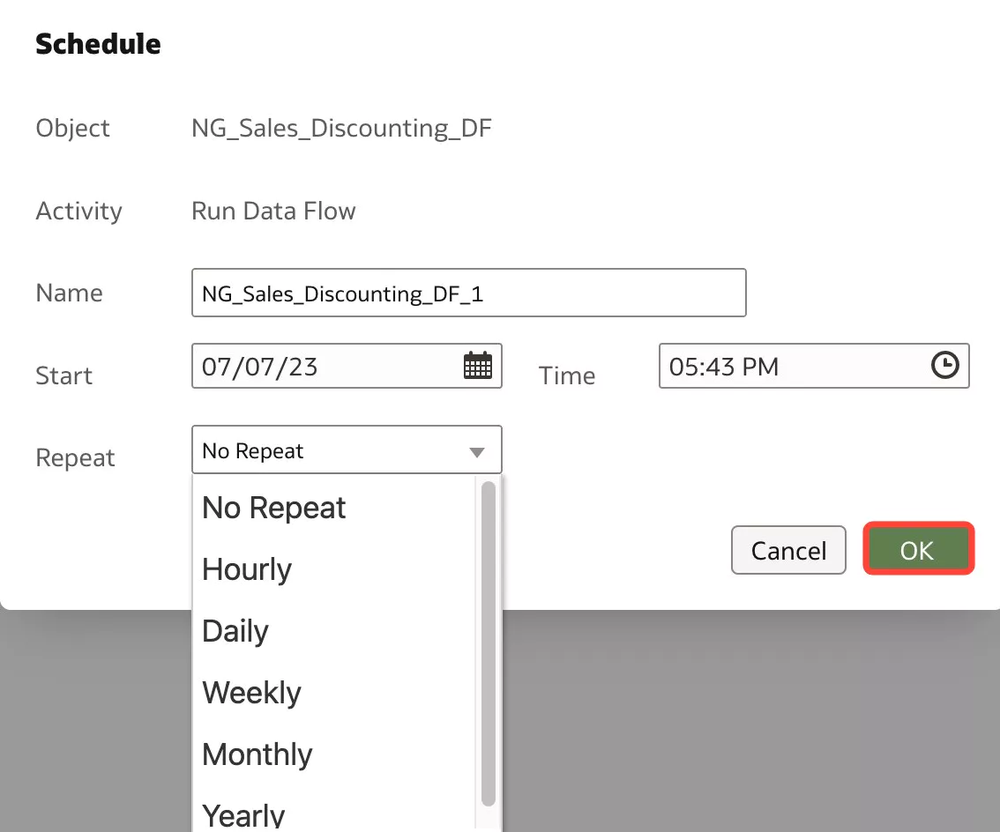
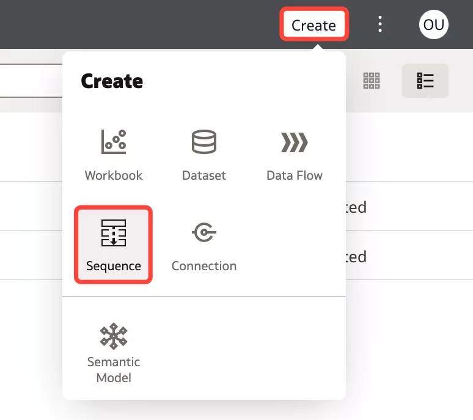

# Test, Deploy, and Validate a Semantic Model

## Introduction

In this lab, you run the consistency checker on the Sample Sales semantic model, deploy the semantic model, and validate the subject area by creating visualizations in Oracle Analytics Cloud.

Estimated Time: 5 minutes

### Objectives

In this lab, you will:
* Run the consistency checker
* Deploy the Sample Sales semantic model
* Validate the subject area by creating visualizations in Oracle Analytics Cloud

### Prerequisites

This lab assumes you have:
* Access to Oracle Analytics Cloud
* Access to DV Content Author, BI Data Model Author, or a BI Service Administrator role
* All previous labs successfully completed

## Task 1: Inspect the Data Flow

1. Click the **Navigation** menu and select **Jobs**.

	

2. Here, you can view the data flow jobs and their status'.

	

3. Click the **Navigation** menu and select **Data**. We will take a look at the dataset outputs from the data flows we created.

	

4. Here, you see all the datasets we created such as **xx\_Sales\_Discounting**, **xx\_Matched\_Products**, **xx\_Missing\_Products**, **xx\_Sales\_Reps\_All\_Products**, and **xx_Products**. Click **Data Flows** to view the two data flows we created.

	

5. Once your **xx\_Sales\_Discounting** data flow is completed, right-click and select **Inspect**.

	

6. Click **Sources/Tables**. Here you can view the data sources that were used in this data flow, including the target dataset. Click **Close**.

	

## Task 2: Schedule a Data Flow

1. We'll now set a schedule to run the **xx\_Sales\_Discounting** data flow. Right-click the Sales Discounting data flow and click **New Schedule**.

	

2. Configure the schedule to run the data flow and click **OK**.

	

3. Right-click the same data flow and this time, select **Inspect**.

	

4. Click **Schedules** and the schedule you set will appear here. Click **Close**. We will now explore how to create a data flow sequence.

	

## Task 3: Create a Data Flow Sequence

1. Click **Create** and select **Sequence**. This will open the data flow sequence setup window.

	

2. Drag **xx\_Product\_Match\_DF** and **xx\_Sales\_Discounting\_DF** into the selections pane. Make sure the Product_Math_DF is placed before the Sales_Discounting_DF since the Sales_Discounting_DF relies on the output created from the Product_Match_DF. Click **Save**.

	

3. Enter **xx\_DF\_Sequence** for **Name** and click **OK**.

	

4. Click the back arrow to return to the **Data** page.

	

5. Click the **Sequences** tab. Right-click the **DF_Sequence** and click **Run**.

	

6. The DF_Sequence will now run in the order you have created.

You may proceed to the next lab.

## Learn More
* [Process Data Using a Sequence of Data Flows](https://docs.oracle.com/en/cloud/paas/analytics-cloud/acubi/process-data-using-sequence-data-flows.html#GUID-CA3C5C48-069B-4D4B-A989-5932A1B421EB)

## Acknowledgements
* **Author** - Nagwang Gyamtso, Product Manager, Analytics Product Strategy
* **Contributors** - Lucian Dinescu
* **Last Updated By/Date** - Nagwang Gyamtso, July, 2023
