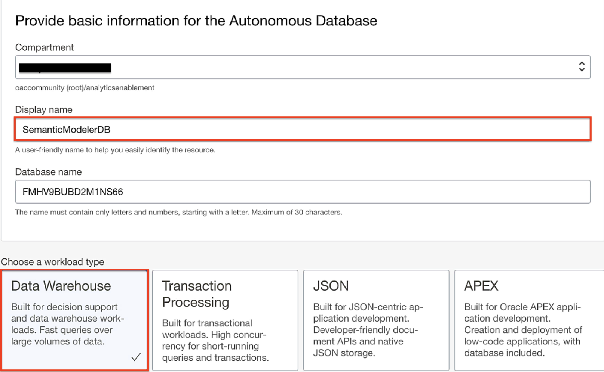
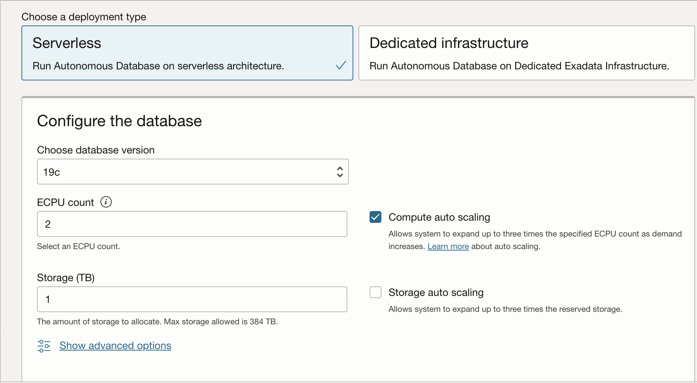
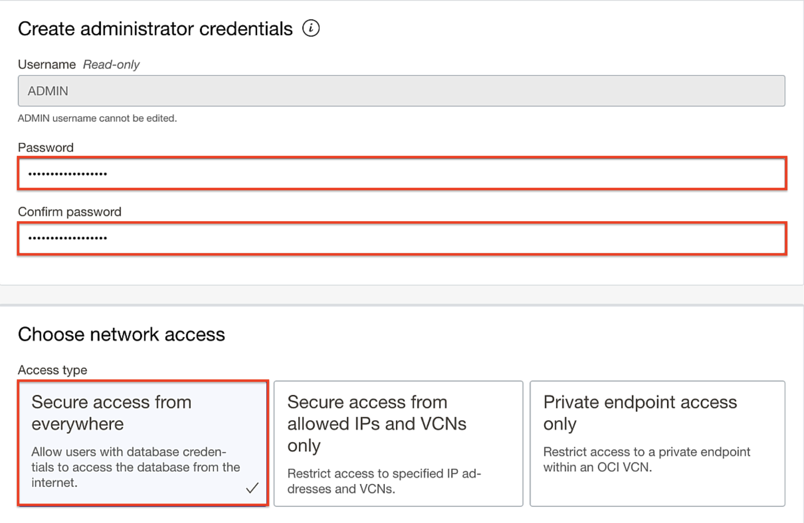
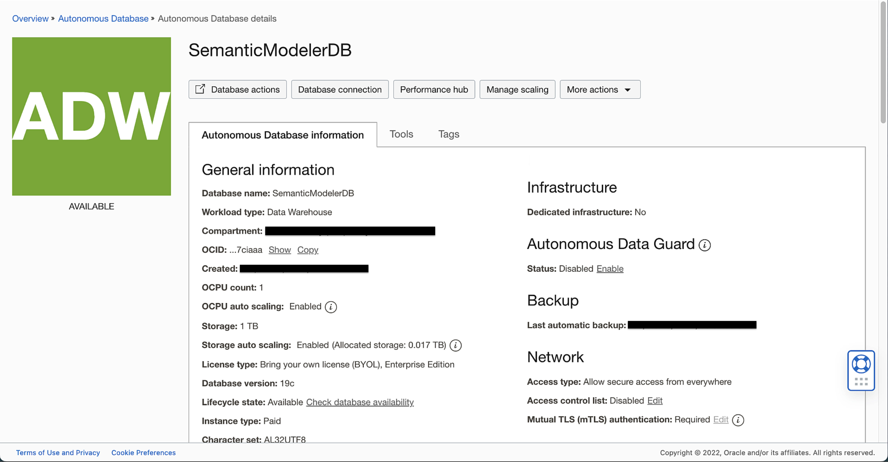
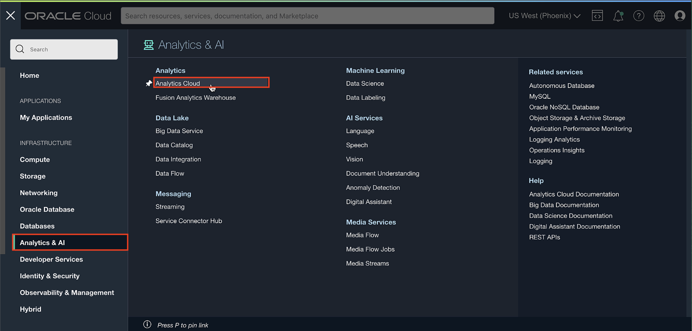

# Provision your Oracle Autonomous Data Warehouse Database (ADW) and Oracle Analytics Cloud (OAC) Instances

## Introduction

This lab walks you through the steps of creating an Autonomous Data Warehouse and an Oracle Analytics Cloud instance. You will provision a new database and an OAC instance in less than 10 minutes.

Oracle Autonomous Databases have the following characteristics:

**Self-driving**
Automates database provisioning, tuning, and scaling.

- Provisions highly available databases, configures and tunes for specific workloads, and scales compute resources when needed, all done automatically.

**Self-securing**
Automates data protection and security.

- Protect sensitive and regulated data automatically, patch your database for security vulnerabilities, and prevent unauthorized access—all with Oracle Autonomous Database.

**Self-repairing**
Automates failure detection, failover, and repair.

- Detect and protect from system failures and user errors automatically and provide failover to standby databases with zero data loss.

Watch our short video that explains Lab 1 - Provision your Autonomous Database and Oracle Analytics Cloud instance in detail:

_Estimated Time:_ 15 minutes

### Objectives
- Create an Autonomous Database
- Create an Oracle Analytics Cloud instance

### Prerequisites

* An [_Oracle Cloud Free Tier Account_](https://www.oracle.com/cloud/free/) or a Paid account.  

  > **Note:** If you have a **Free Trial** account, when your Free Trial expires your account will be converted to an **Always Free** account. You will not be able to conduct Free Tier workshops unless the Always Free environment is available. **[Click here for the Free Tier FAQ page.](https://www.oracle.com/cloud/free/faq.html)**

## Task 1: Create a new Autonomous Data Warehouse Database

1. Click on the hamburger **menu (Navigator)** link at the upper left corner of the page and select **Autonomous Data Warehouse.**  
    

2. To create a new instance, click the blue **Create Autonomous Database** button.

    

3. Choose a compartment and enter <code> SemanticModelerDB </code> for the display name. Choose Data Warehouse for the workload type.

    >**Note:** Verify that a compartment (&lt;tenancy_name&gt;) is selected. By default, any OCI tenancy has a default ***root*** compartment, named after the tenancy itself. The tenancy administrator (default root compartment administrator) is any user who is a member of the default Administrators group. For the workshop purpose, you can use ***root*** or create your own _Compartment_ under the **root** folder.

  

4. Under Configure the database, choose the following options:

  

    >**Note:** **Not recommended for this lab**, but you can select Always Free configuration to start enjoying your free Autonomous Database. With the Always Free option you will not be able to scale the database when needed.

  [If you select 'Always Free Tier On', please check the following link](https://www.oracle.com/uk/cloud/free/#always-free).

5. Enter a password under **Create administration credentials**. Select Secure access from everywhere under **Choose network access**.

    >**Reminder:** Record your password in a safe location as this cannot be easily reset.

  

6. Under **Choose a license type**, select **License Type: License Included**. When you have completed the required fields, scroll down and click on the blue **Create Autonomous Database** button.  

  

6. A summary of your instance status is shown in the large box on the left. In this example, the color is amber and the status is **Provisioning.**  

  

7. After a short while, the status turns to **Available State** and the "ADW" box will change to green.
  

8. Once the Instance Status is **Available**, additional summary information about your instance is populated, including workload type and other details. The provisioning process should take **under 5 minutes**.

9. This page is known as the **Autonomous Database Details Page**. It provides you with status information about your database, and its configuration. Get **familiar** with the buttons and tabs on this page.  

  

You have just created an Autonomous Database with the latest features of Oracle Databases.

## Task 2: Create an Oracle Analytics Cloud (OAC) Instance

Return to the Oracle Cloud Infrastructure Console accessing from **Oracle Home Page** (oracle.com) and sign in into your cloud account.
Click in **View Account** and **Sign in to Cloud**.  

1. Go to **Home Console Page** and navigate to **Analytics & AI** section and then select **Analytics Cloud**.

    

2. Select **Create Instance**.

  

3. Enter the following options and click **Create**.
    * Instance name: Enter an instance name
    * Compartment: Choose a valid compartment in your tenancy
    * Capacity: OCPU
    * OCPU Count: 2
      > **Important:** 1 OCPU OAC instance is for Trials Only; you cannot scale up an 1 OCPU instance once needed, and the shape you choose comes with [Limits for Querying, Displaying, Exporting Data](https://docs.oracle.com/en/cloud/paas/analytics-cloud/acsom/create-services-oracle-analytics-cloud.html#GUID-164D8568-9AE3-4A74-9F1A-0D87B78713C9) => **DO NOT create an 1 OCPU instance for OAC Production environments**

    * License type: License Included
    * Edition: Enterprise Edition

  
  

4. The Analytics instance page will be displayed with a status of ***CREATING***.

    ***Reminder***: Provisioning an Oracle Analytics Cloud instance can take over **40 minutes**.

6. The Analytics instance page will be displayed with a status of ***ACTIVE***.  

    

You may now **proceed to the next lab**.

## **Acknowledgements**

- **Author** - Nagwang Gyamtso, Product Strategy, Analytics
- **Contributors** - Lucian Dinescu, Product Strategy, Peter Monteiro, Product Management
- **Reviewed by** -
- **Last Updated By/Date** -
